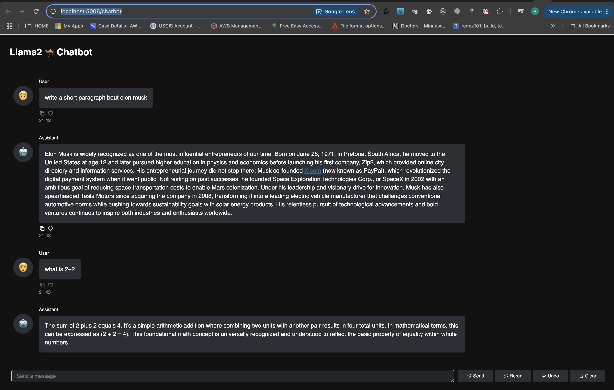

# Let's Build Chatbot using Python Libraries Panel & Ollama | No OpenAI API

video : https://www.youtube.com/watch?v=ilAZdYvlKKM
## Setup ollama locally

How to Install and Run Ollama on macOS: 
[Here](https://www.metriccoders.com/post/how-to-install-and-run-ollama-on-macos)

Ollama is a powerful tool that allows you to run large language models locally on your Mac. This guide will walk you through the steps to install and run Ollama on macOS.


### Prerequisites
A Mac running macOS 11 Big Sur or later

An internet connection to download the necessary files


### Step 1: Download Ollama
Visit the Ollama download page: https://ollama.com/download/mac

Click on the Download for macOS button.

Once the download is complete, locate the .zip file in your ~/Downloads folder.

Double-click the .zip file to extract its contents. This should create Ollama.app.


### Step 2: Install Ollama
Drag Ollama.app to your Applications folder.

Open the Applications folder and double-click on Ollama.app.

If you see a warning, click Open to proceed.

Follow the setup wizard to complete the installation. The wizard will prompt you to install the command line version (ollama).


### Step 3: Running a Model
Open the Terminal application.

To run the Llama 3 model, type the following command and press Enter:`ollama run llama3`

The first time you run this command, it will download the latest version of the model. This may take some time depending on your internet speed.


### Step 4: Interacting with the Model
Once the model is downloaded, you will see a prompt like this:>>> Send a message (/? for help)

Start chatting with the model by typing your messages at the prompt.

```sh
$ ollama run llama3.2
pulling manifest
pulling dde5aa3fc5ff... 100% ▕█████████████████████████████████████████████████████████████████████████████████████████████████████████████████████████████████████████▏ 2.0 GB
pulling 966de95ca8a6... 100% ▕█████████████████████████████████████████████████████████████████████████████████████████████████████████████████████████████████████████▏ 1.4 KB
pulling fcc5a6bec9da... 100% ▕█████████████████████████████████████████████████████████████████████████████████████████████████████████████████████████████████████████▏ 7.7 KB
pulling a70ff7e570d9... 100% ▕█████████████████████████████████████████████████████████████████████████████████████████████████████████████████████████████████████████▏ 6.0 KB
pulling 56bb8bd477a5... 100% ▕█████████████████████████████████████████████████████████████████████████████████████████████████████████████████████████████████████████▏   96 B
pulling 34bb5ab01051... 100% ▕█████████████████████████████████████████████████████████████████████████████████████████████████████████████████████████████████████████▏  561 B
verifying sha256 digest
writing manifest
success
>>> hi
How can I assist you today?

>>> wht is your name?
I don't have a personal name, but I'm an AI designed to assist and communicate with users in a helpful and informative way. You can think of me as a conversational AI or a language model. Some
people also refer to me as "Assistant" or "AI Companion". What's your name?

>>> Rasanjalee
It's lovely to meet you, Rasanjalee! I'm glad we could have a chance to chat and get to know each other. Is there anything in particular you'd like to talk about or ask me about? I'm all ears (or
rather, all text).

>>>/bye
$ 
```

### Step 5: Getting Help
To get help at the prompt, type /? and press Enter.

To get help from the command line interface, simply run the command without any arguments:ollama


### Step 6: Managing Models
To see a list of currently installed models, run:`ollama list`

To remove a model and free up disk space, run:`ollama rm llama3`

### Step7: Install phi3

Run : `ollama pull phi3`


```sh
ollama pull phi3
pulling manifest
pulling 633fc5be925f... 100% ▕█████████████████████████████████████████████████████████████████████████████████████████████████████████████████████████████████████████▏ 2.2 GB
pulling fa8235e5b48f... 100% ▕█████████████████████████████████████████████████████████████████████████████████████████████████████████████████████████████████████████▏ 1.1 KB
pulling 542b217f179c... 100% ▕█████████████████████████████████████████████████████████████████████████████████████████████████████████████████████████████████████████▏  148 B
pulling 8dde1baf1db0... 100% ▕█████████████████████████████████████████████████████████████████████████████████████████████████████████████████████████████████████████▏   78 B
pulling 23291dc44752... 100% ▕█████████████████████████████████████████████████████████████████████████████████████████████████████████████████████████████████████████▏  483 B
verifying sha256 digest
writing manifest
success

$ (base)  Rasanjalee@jayampathis-mbp  ollama list
NAME               ID              SIZE      MODIFIED
phi3:latest        4f2222927938    2.2 GB    About a minute ago
llama3.2:latest    a80c4f17acd5    2.0 GB    8 minutes ago

#we need only phi3. lets uninstall llama3.2 as it takes 2GB space.
$ (base)  Rasanjalee@jayampathis-mbp ollama rm llama3.2:latest
deleted 'llama3.2:latest'

$ (base)  Rasanjalee@jayampathis-mbp  ~/.auto-shutdown  ollama list
NAME           ID              SIZE      MODIFIED
phi3:latest    4f2222927938    2.2 GB    2 minutes ago
```

### Run ollama

```sh
$ ollama serve
```


## Run chatbot


### create  virtual environment and activate:
```sh
conda create chatbot-app
conda activate chatbot-app
```

### create requirments.txt and install:

```txt
ollama
panel 
watchfiles
```

```sh
pip install -r requirements.txt 
```

### create chatbot.py
```py
import panel as pn
import ollama
from ollama import Client

pn.config.theme = 'dark'

def generate_response(contents: str, user: str, chat_interface: pn.chat.ChatInterface):
    chat_history = chat_interface.serialize(format="transformers",)
    response = client.chat(model='phi3', stream=True, messages=chat_history)
    message = ""
    for partial_resp in response:
        token = partial_resp["message"]["content"]
        message += token
        yield message

client = Client(
  host='http://localhost:11434'
)

chat_interface = pn.chat.ChatInterface(callback=generate_response)
chat_interface.send("Hi! How can i help you?", user="System", avatar="🤖", respond=False)

chatbot = pn.Column(
    pn.pane.Markdown("# Llama2 🐪 Chatbot"),
    chat_interface,
    styles={"padding": "15px", 'border': '1px solid white',}
)

chatbot.servable()
```

### run chatbot

```sh
panel serve --show chatbot.py
```

This will open chatbot UI: http://localhost:5006/chatbot

Now you can type questions and interact.
