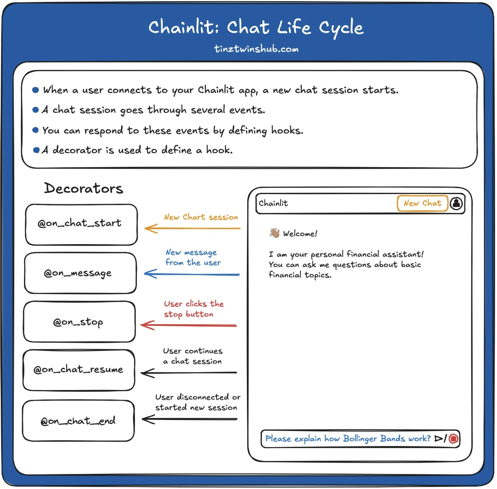

Refere: [
Build a Local Chatbot in Minutes with Chainlit](https://tinztwinshub.com/software-engineering/build-a-local-chatbot-in-minutes-with-chainlit/)

# This docker setup didn't work.
docker-compose up -d and opening http://localhost:8000 webui to chat hi to chatbot gav all connections refused error.

You can use `sh docker-clean.sh` toclean containers and images when testing


## What is Chainlit?
Chainlit is an` open-source python framework that simplifies the creation of chatbot apps with a ChatGPT-like User Interface`. Chainlit provides many benefits for developers. You can build apps very fast because you can integrate them seamlessly with an existing code base or create a new app from scratch in minutes. Furthermore, you can write the chatbot logic once and use it everywhere. You can use a Chainlit app across multiple platforms.

C`hainlit is the perfect starting point for anyone who wants to create production-ready chatbots`. Furthermore, Chainlit offers many possibilities for customization. If this is not enough, `you can also use Chainlit with your own custom frontend`. In addition, Chainlit can be used very flexibly and is constantly being improved with new functions.

## Chat Life Cycle

In this tutorial, we will focus on the main concepts of Chainlit. The framework offers many features, but for beginners, only a few are necessary. For this reason, we will introduce you to the most important features.

`Every Chainlit app follows a life cycle`. 
- When a user opens your Chainlit app, a new chat session is created. 
- A chat session goes through a life cycle of events. 
- You can respond to events by using decorators (marked with @).
-  A decorator defines a hook that is called when a specific event occurs. 
-  The following figure illustrates the procedure.



## Create a local Chatbot with ChainlitPermalink

### Step 1 - Environment Setup

create a virtual Python environment via conda:
```sh
conda create --name chatbot-app python=3.10.14
```

activate the environment:
```sh
conda activate chatbot-app  
```

to deactivate when all is done:
```sh
conda deactivate
```

install dependencies:
```sh
pip install chainlit langchain langchain_community
```

**or** 

create requirements.txt:
```txt
chainlit 
langchain
langchain_community
langchain-ollama
```

```sh
pip install -r requirements.txt
```

### Step 2 - download ollama model
we will use ollama model for chtbot. So you must download Ollama from [here](https://ollama.com/). With Ollama, you can run open-source LLMs locally on your computer. This also means that the data is only processed locally on your computer. No API calls are necessary!


Let's use docker to get ollama image and run and install the model we want:

```sh
$ docker run -d -v ollama:/root/.ollama -p 11434:11434 --name ollama ollama/ollama
$ docker ps
CONTAINER ID   IMAGE           COMMAND               CREATED              STATUS              PORTS                      NAMES
107c0a491d2f   ollama/ollama   "/bin/ollama serve"   About a minute ago   Up About a minute   0.0.0.0:11434->11434/tcp   ollama
```

install phi3 model in image:
```
$ docker exec -it ollama bash

# $ ollama list
--shows nothing


# ollama pull nomic-embed-text
# ollama pull phi3

# ollama list
NAME                       ID              SIZE      MODIFIED
phi3:latest                4f2222927938    2.2 GB    3 minutes ago
nomic-embed-text:latest    0a109f422b47    274 MB    5 minutes ago
```


**Or** do with Dockerfile:


create a `docker-llama` folder with following files:

```sh
cd notebooks/04_Falcon-7B-Instruct_LLM_with_LangChain/chainlit-chatbot-local/docker-ollama
```

Dockerfile:
```sh
FROM ollama/ollama

COPY ./run-ollama.sh /tmp/run-ollama.sh

WORKDIR /tmp

RUN chmod +x run-ollama.sh \
    && ./run-ollama.sh

EXPOSE 11434
```

run-ollama.sh:
```sh
#!/bin/bash

echo "Starting Ollama server..."
ollama serve &


echo "Waiting for Ollama server to be active..."
while [ "$(ollama list | grep 'NAME')" == "" ]; do
  sleep 1
done


ollama pull nomic-embed-text
ollama pull phi3

ollama list
```

build image with tag myollama (last . is the path to dockerfile):
```sh
docker build . -t myollama -f .

docker images:
REPOSITORY      TAG          IMAGE ID       CREATED         SIZE
myollama        latest       ca68d997a1f8   4 minutes ago   7.1GB
```

run docker image:
```sh
docker run -d myollama
2c5c40acb13a14a7f64345d68ce8732864ce497c5716778de7b898483c4a3b48

docker ps
CONTAINER ID   IMAGE      COMMAND               CREATED          STATUS         PORTS       NAMES
2c5c40acb13a   myollama   "/bin/ollama serve"   10 seconds ago   Up 7 seconds   11434/tcp   funny_elion

docker exec -it funny_elion bash 
root@2c5c40acb13a:/tmp# ollama list
NAME                       ID              SIZE      MODIFIED    
phi3:latest                4f2222927938    2.2 GB    2 hours ago    
nomic-embed-text:latest    0a109f422b47    274 MB    2 hours ago  
```

### Step 3 - Create an app.py file

app.py:
```py
import chainlit as cl
from langchain_community.llms import Ollama
from langchain.prompts import ChatPromptTemplate
from langchain.schema import StrOutputParser
from langchain.schema.runnable import Runnable
from langchain.schema.runnable.config import RunnableConfig
from chainlit.types import ThreadDict
from chainlit.cli import run_chainlit

@cl.on_chat_start
async def on_chat_start():
    model = Ollama(model="phi3")
    prompt = ChatPromptTemplate.from_messages(
        [
            (
                "system",
                "You are a financial expert with an extensive expert knowledge.",
            ),
            ("human", "{question}"),
        ]
    )
    runnable = prompt | model | StrOutputParser()
    cl.user_session.set("runnable", runnable)


@cl.on_message
async def on_message(message: cl.Message):
    runnable = cl.user_session.get("runnable")  # type: Runnable
    msg = cl.Message(content="")

    async for chunk in runnable.astream(
        {"question": message.content},
        config=RunnableConfig(callbacks=[cl.LangchainCallbackHandler()]),
    ):
        await msg.stream_token(chunk)

    await msg.send()

@cl.on_stop
def on_stop():
    print("The user wants to stop the task!")

@cl.on_chat_end
def on_chat_end():
    print("The user disconnected!")

@cl.on_chat_resume
async def on_chat_resume(thread: ThreadDict):
    print("The user resumed a previous chat session!")
    
if __name__ == "__main__":
    run_chainlit(__file__)
```

### Step 4 - Run the chatbot app

https://github.com/aisingapore/sealion-chainlit-ollama/blob/main/src/main.py