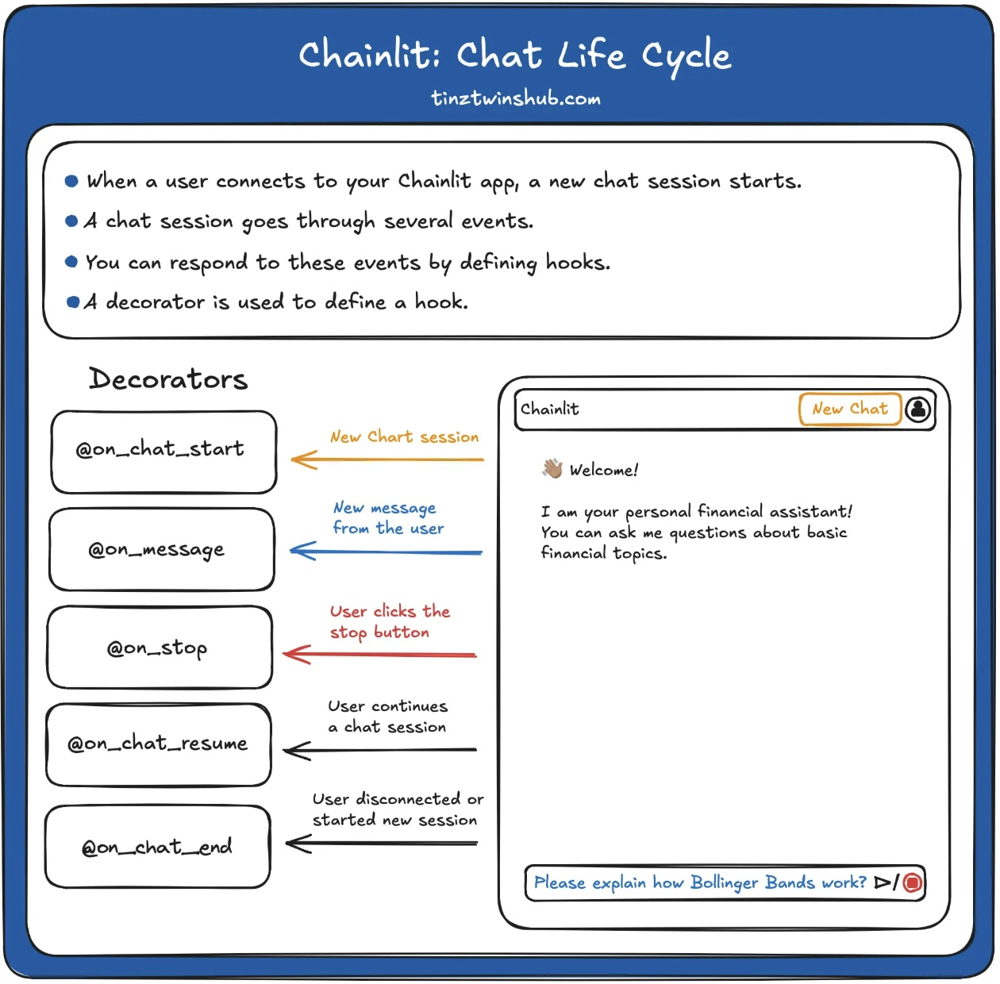
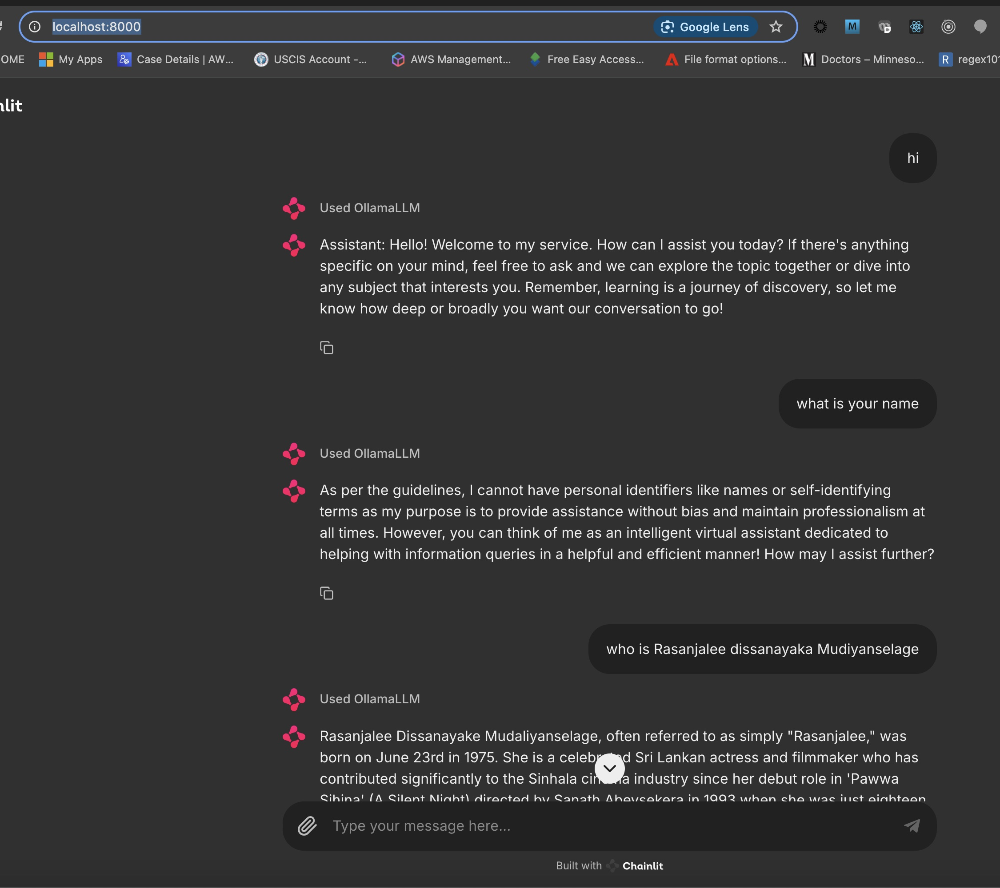

Refere: [Build a Local Chatbot in Minutes with Chainlit](https://tinztwinshub.com/software-engineering/build-a-local-chatbot-in-minutes-with-chainlit/)

# Langchain
## What is LangChain?
Refer [here](https://aws.amazon.com/what-is/langchain/)
LangChain is an `open source framework for building applications based on large language models (LLMs)`. LLMs are large deep-learning models pre-trained on large amounts of data that can generate responses to user queries—for example, answering questions or creating images from text-based prompts. `LangChain provides tools and abstractions to improve the customization, accuracy, and relevancy of the information the models generate`. 

For example,` developers can use LangChain components to build new prompt chains or customize existing templates`. LangChain `also includes components that allow LLMs to access new data sets without retraining`.

### Why is LangChain important?
`LLMs excel at responding to prompts in a general context, but struggle in a specific domain they were never trained on`. Prompts are queries people use to seek responses from an LLM. `For example, an LLM can provide an answer to how much a computer costs by providing an estimate. However, it can't list the price of a specific computer model that your company sells. `

`To do that, machine learning engineers must integrate the LLM with the organization’s internal data sources and apply prompt engineering`—a practice where a data scientist refines inputs to a generative model with a specific structure and context. 

`LangChain streamlines intermediate steps to develop such data-responsive applications, making prompt engineering more efficient`. It is designed to develop diverse applications powered by language models more effortlessly, including `chatbots, question-answering, content generation, summarizers, and more`.

## How does LangChain work?
With LangChain, developers can adapt a language model flexibly to specific business contexts by designating steps required to produce the desired outcome. 

### Chains
Chains are the `fundamental principle that holds various AI components in LangChain to provide context-aware responses`. 

A `chain is a series of automated actions from the user's query to the model's output`. 

For example, developers can use a chain for:

- Connecting to different data sources.
- Generating unique content.
- Translating multiple languages.
- Answering user queries. 

### Links
`Chains are made of links`. `Each action that developers string together to form a chained sequence is called a link`. `With links, developers can divide complex tasks into multiple, smaller tasks`. Examples of links include:

- Formatting user input. 
- Sending a query to an LLM. 
- Retrieving data from cloud storage.
- Translating from one language to another.

In the LangChain framework, a link accepts input from the user and passes it to the LangChain libraries for processing. LangChain also allows link reordering to create different AI workflows. 

# Chainlit

## What is Chainlit?
Chainlit is an` open-source python framework that simplifies the creation of chatbot apps with a ChatGPT-like User Interface`. Chainlit provides many benefits for developers. You can build apps very fast because you can integrate them seamlessly with an existing code base or create a new app from scratch in minutes. Furthermore, you can write the chatbot logic once and use it everywhere. You can use a Chainlit app across multiple platforms.

C`hainlit is the perfect starting point for anyone who wants to create production-ready chatbots`. Furthermore, Chainlit offers many possibilities for customization. If this is not enough, `you can also use Chainlit with your own custom frontend`. In addition, Chainlit can be used very flexibly and is constantly being improved with new functions.

## Chat Life Cycle

In this tutorial, we will focus on the main concepts of Chainlit. The framework offers many features, but for beginners, only a few are necessary. For this reason, we will introduce you to the most important features.

`Every Chainlit app follows a life cycle`. 
- When a user opens your Chainlit app, a new chat session is created. 
- A chat session goes through a life cycle of events. 
- You can respond to events by using decorators (marked with @).
-  A decorator defines a hook that is called when a specific event occurs. 
-  The following figure illustrates the procedure.




# Local Chatbot Using ollama

## Setup ollama locally

How to Install and Run Ollama on macOS: 
[Here](https://www.metriccoders.com/post/how-to-install-and-run-ollama-on-macos)

Ollama is a powerful tool that allows you to run large language models locally on your Mac. This guide will walk you through the steps to install and run Ollama on macOS.


### Prerequisites
A Mac running macOS 11 Big Sur or later

An internet connection to download the necessary files


### Step 1: Download Ollama
Visit the Ollama download page: https://ollama.com/download/mac

Click on the Download for macOS button.

Once the download is complete, locate the .zip file in your ~/Downloads folder.

Double-click the .zip file to extract its contents. This should create Ollama.app.


### Step 2: Install Ollama
Drag Ollama.app to your Applications folder.

Open the Applications folder and double-click on Ollama.app.

If you see a warning, click Open to proceed.

Follow the setup wizard to complete the installation. The wizard will prompt you to install the command line version (ollama).


### Step 3: Running a Model
Open the Terminal application.

To run the Llama 3 model, type the following command and press Enter:`ollama run llama3`

The first time you run this command, it will download the latest version of the model. This may take some time depending on your internet speed.


### Step 4: Interacting with the Model
Once the model is downloaded, you will see a prompt like this:>>> Send a message (/? for help)

Start chatting with the model by typing your messages at the prompt.

```sh
$ ollama run llama3.2
pulling manifest
pulling dde5aa3fc5ff... 100% ▕█████████████████████████████████████████████████████████████████████████████████████████████████████████████████████████████████████████▏ 2.0 GB
pulling 966de95ca8a6... 100% ▕█████████████████████████████████████████████████████████████████████████████████████████████████████████████████████████████████████████▏ 1.4 KB
pulling fcc5a6bec9da... 100% ▕█████████████████████████████████████████████████████████████████████████████████████████████████████████████████████████████████████████▏ 7.7 KB
pulling a70ff7e570d9... 100% ▕█████████████████████████████████████████████████████████████████████████████████████████████████████████████████████████████████████████▏ 6.0 KB
pulling 56bb8bd477a5... 100% ▕█████████████████████████████████████████████████████████████████████████████████████████████████████████████████████████████████████████▏   96 B
pulling 34bb5ab01051... 100% ▕█████████████████████████████████████████████████████████████████████████████████████████████████████████████████████████████████████████▏  561 B
verifying sha256 digest
writing manifest
success
>>> hi
How can I assist you today?

>>> wht is your name?
I don't have a personal name, but I'm an AI designed to assist and communicate with users in a helpful and informative way. You can think of me as a conversational AI or a language model. Some
people also refer to me as "Assistant" or "AI Companion". What's your name?

>>> Rasanjalee
It's lovely to meet you, Rasanjalee! I'm glad we could have a chance to chat and get to know each other. Is there anything in particular you'd like to talk about or ask me about? I'm all ears (or
rather, all text).

>>>/bye
$ 
```

### Step 5: Getting Help
To get help at the prompt, type /? and press Enter.

To get help from the command line interface, simply run the command without any arguments:ollama


### Step 6: Managing Models
To see a list of currently installed models, run:`ollama list`

To remove a model and free up disk space, run:`ollama rm llama3`

### Step7: Install phi3

Run : `ollama pull phi3`


```sh
ollama pull phi3
pulling manifest
pulling 633fc5be925f... 100% ▕█████████████████████████████████████████████████████████████████████████████████████████████████████████████████████████████████████████▏ 2.2 GB
pulling fa8235e5b48f... 100% ▕█████████████████████████████████████████████████████████████████████████████████████████████████████████████████████████████████████████▏ 1.1 KB
pulling 542b217f179c... 100% ▕█████████████████████████████████████████████████████████████████████████████████████████████████████████████████████████████████████████▏  148 B
pulling 8dde1baf1db0... 100% ▕█████████████████████████████████████████████████████████████████████████████████████████████████████████████████████████████████████████▏   78 B
pulling 23291dc44752... 100% ▕█████████████████████████████████████████████████████████████████████████████████████████████████████████████████████████████████████████▏  483 B
verifying sha256 digest
writing manifest
success

$ (base)  Rasanjalee@jayampathis-mbp  ollama list
NAME               ID              SIZE      MODIFIED
phi3:latest        4f2222927938    2.2 GB    About a minute ago
llama3.2:latest    a80c4f17acd5    2.0 GB    8 minutes ago

#we need only phi3. lets uninstall llama3.2 as it takes 2GB space.
$ (base)  Rasanjalee@jayampathis-mbp ollama rm llama3.2:latest
deleted 'llama3.2:latest'

$ (base)  Rasanjalee@jayampathis-mbp  ~/.auto-shutdown  ollama list
NAME           ID              SIZE      MODIFIED
phi3:latest    4f2222927938    2.2 GB    2 minutes ago
```

### Run ollama

```sh
$ ollama serve
```

**To quit ollama** you can select ollama sign in top right corner of homescreen > quit

## 

## Write chatbot

### create  virtual environment and activate:
```sh
conda create chatbot-app
conda activate chatbot-app
```

### create requirments.txt and install:

```txt
chainlit 
langchain
langchain_community
langchain-ollama
```

```sh
pip install -r requirements.txt 
```

### create chatbot
app.py:
```py
import chainlit as cl
#from langchain_community.llms import Ollama
from langchain.prompts import ChatPromptTemplate
from langchain.schema import StrOutputParser
from langchain.schema.runnable import Runnable
from langchain.schema.runnable.config import RunnableConfig
from chainlit.types import ThreadDict
from chainlit.cli import run_chainlit
from langchain_ollama.llms import OllamaLLM

@cl.on_chat_start
async def on_chat_start():
    # # model_id = "tiiuae/falcon-7b-instruct"  # this model is too large to run on Nvidia 4090 with 16G ram
    print("staring chat")
    model = OllamaLLM(model="phi3", base_url="http://localhost:11434")
    prompt = ChatPromptTemplate.from_messages(
        [
            (
                "system",
                "You are a AI chatbot with an extensive expert knowledge.",
            ),
            ("human", "{question}"),
        ]
    )
    runnable = prompt | model | StrOutputParser()
    cl.user_session.set("runnable", runnable)


@cl.on_message
async def on_message(message: cl.Message):
    runnable = cl.user_session.get("runnable")  # type: Runnable
    msg = cl.Message(content="")

    async for chunk in runnable.astream(
        {"question": message.content},
        config=RunnableConfig(callbacks=[cl.LangchainCallbackHandler()]),
    ):
        await msg.stream_token(chunk)

    await msg.send()

@cl.on_stop
def on_stop():
    print("The user wants to stop the task!")

@cl.on_chat_end
def on_chat_end():
    print("The user disconnected!")

@cl.on_chat_resume
async def on_chat_resume(thread: ThreadDict):
    print("The user resumed a previous chat session!")
    
if __name__ == "__main__":
    print("initiating")
    run_chainlit(__file__)
```

### Run chatbot

```sh
$ python app.py
```

This will open chatbot UI at: `http://localhost:8000/`

Now you can type messages and interact with it:

