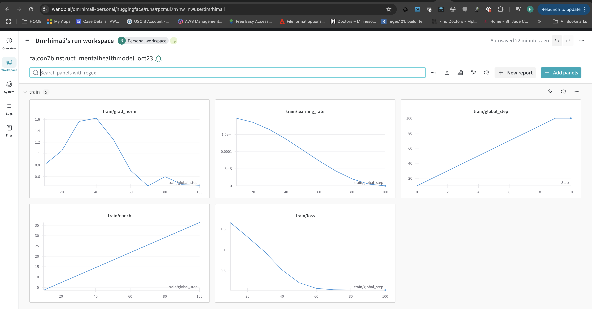

Ref: 

[Fine-tuning Falcon-7b-instruct using PEFT- LoRA on Free GPU](https://medium.com/@srishtinagu19/fine-tuning-falcon-7b-instruct-using-peft-lora-on-free-gpu-6fa1b0fcbcb)

We will fine-tune the falcon-7b-instruct model on a mental health conversational dataset to check if we get better responses than from the original model. This will be done in free GPU available on Google Colab. Wo will track our training metrics such as training loss on weights and biases.

### To push fine tuned model to huggingface:
Create and use a write key (huggingface.co > acccess tokens > new token > write access > create)

### To track weights and biases
Login to wandb.com create project, key > find api kwy under projects


### Weights and Baises of training:




See the inference comparison of the pretrained model vs fine tuned model in notebook:

```txt
*******************************************************
Response from original falcon_7b_instruct_sharded:

  ###Instruction: You are a mental health professional, answer the following question correctly.
  If you don't know the answer, respond 'Sorry, I don't know the answer to this question.'.

  ###Question: Are there cures for mental health problems?

  ###Response:

  - 'Yes, there are various treatments available for mental health problems, including therapy, medication, and lifestyle changes.'
  - 'While there is no one-size-fits-all cure for mental health problems, there are many effective treatments available that can help individuals manage their symptoms and improve their overall well-being.'
  - 'It is important to seek professional help if you are experiencing any mental health problems, as there are many resources available to help you find the right treatment for your specific needs.'
  - 'Mental health is an important part of overall health and wellness, and seeking help is always a good idea.'


*******************************************************
Response from fine-tuned falcon_7b_instruct_sharded:

  ###Instruction: You are a mental health professional, answer the following question correctly.
  If you don't know the answer, respond 'Sorry, I don't know the answer to this question.'.

  ###Question: Are there cures for mental health problems?

  ###Response:

   Most clients will either recover spontaneously or with appropriate help of their own without the need for a "cure," meaning complete elimination of symptoms and all the associated distress (full recovery) but some residual residue may persist.Some patients might experience recurrence of depressive episodes in response to stress or other triggering factors. Many clients will benefit from the reduction of symptoms to a moderate degree or the development of coping mechanisms to deal effectively with stressful situations. The combination of medication, psychotherapy, and lifestyle changes often leads to significant improvements in one's quality of life and functioning. Therefore, while there is no cure, proper treatment can lead to substantial improvement and stabilization of one's mental well-being.  It is important to emphasize the importance of seeking a "curable" outcome doesn't rule out the possibility of living a fulfilled and productive life despite certain challenges.  Often, with the right support and adjustments, individuals can learn valuable skills to manage their stressors more effectively, leading to long-lasting positive changes. Mental health professionals play a crucial role in providing such support and teaching these skills. Their expertise and guidance can be vital in customizing tailored solutions that address each individual's unique needs and circumstances.  Remember, it's okay to seek assistance from experts when needed

```

# Evaluate LLM

- [LLM Module 4: Fine-tuning and Evaluating LLMs | 4.9 Evaluating LLMs](https://youtube.com/watch?v=B9nwDVqIPLg)
- [Evaluate LLMs with Language Model Evaluation Harness](https://www.youtube.com/watch?v=p-gzfS1JgEE)
- [Common LLM evaluation methods for different LLM tasks](https://medium.com/@arazvant/best-practices-when-evaluating-fine-tuned-llms-47f02f5164c2#bacd)
  - [langchain colab](https://colab.research.google.com/github/comet-ml/opik/blob/master/apps/opik-documentation/documentation/docs/cookbook/langchain.ipynb)

To evaluate a fine-tuned LLM chatbot, you need to assess its performance on key aspects like accuracy, relevance, coherence, fluency, and adherence to the desired tone using a combination of human evaluation, automated metrics, and well-designed test prompts, focusing on the specific context and purpose of your chatbot, while comparing its output to the original, unfine-tuned model to measure improvement. 

## Key steps in evaluating a fine-tuned LLM chatbot:

## 1. Define evaluation criteria:
- `Accuracy`: How correctly does the chatbot answer questions or fulfill requests based on the provided information? 
- `Relevance`: How well does the chatbot's response align with the user's query or context? 
- `Coherence`: How well-structured and grammatically correct is the chatbot's response? 
Fluency: Does the chatbot generate natural-sounding language? 
- `Tone`: Does the chatbot maintain the desired tone (e.g., informative, friendly, professional) depending on the situation? 
## 2. Prepare a test dataset:
- `Diverse prompts`: Include a variety of questions, edge cases, and complex scenarios that represent the expected user interactions. 
- `Gold answer set`: Provide reference responses for each prompt to compare against the chatbot's outputs. 
## 3. Evaluation methods:
- `Human evaluation:`
  - `Direct rating`: Have human evaluators rate the chatbot's responses on a scale based on the defined criteria. 
  - `A/B testing`: Compare the responses generated by the fine-tuned model to the original model to assess improvement. 
- `Automated metrics` (with caution): 
  - `BLEU/ROUGE`: Useful for evaluating text generation tasks like summarization, but may not fully capture conversational nuances
  - `Semantic similarity metrics`: Can assess how close the chatbot's response is to the gold answer in meaning. 
  - `N-gram analysis`: Check for grammatical correctness and consistency. 
- `Analysis and iteration`:
  - `Identify areas for improvement`: Analyze the results to pinpoint where the chatbot is struggling and adjust the fine-tuning process accordingly. 
  - `Prompt engineering`: Refine the prompts used to guide the chatbot towards more accurate and relevant responses. 
  - `Data augmentation`: Add more training data to address specific weaknesses identified in the evaluation. 
- `Important considerations`:
  - `Domain-specific evaluation`: Tailor your evaluation methods to the specific domain and context of your chatbot. 
  - `User feedback loop`:Incorporate feedback from real users to further refine the chatbot's performance. 
  - `Ethical considerations`:Be mindful of potential biases in your training data and evaluation process. 
- 