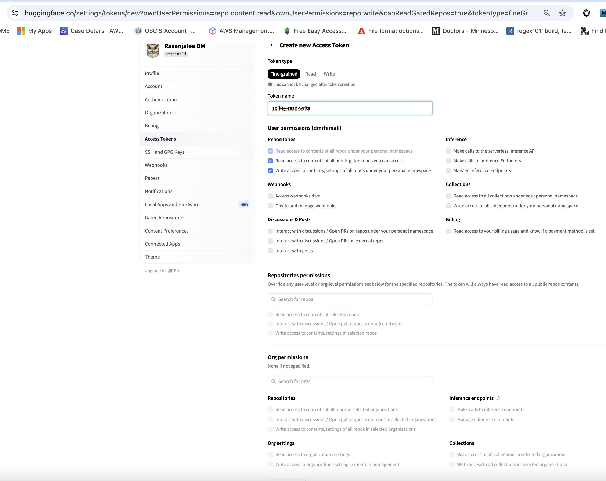
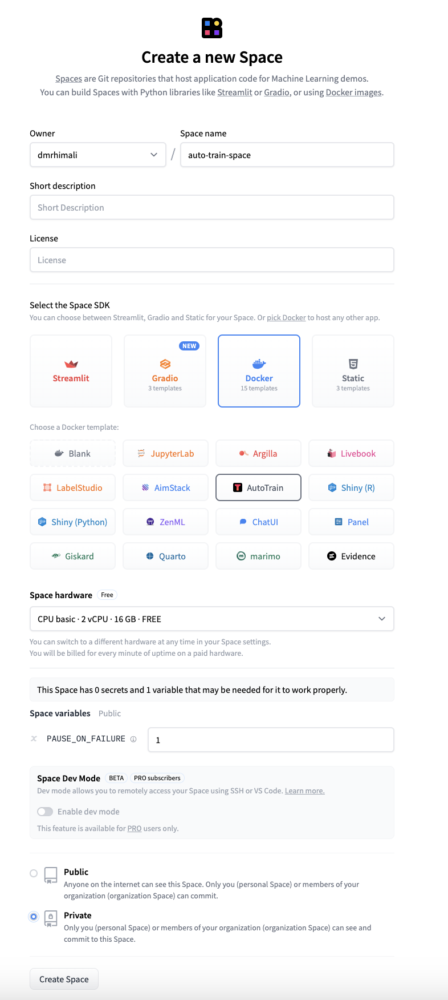
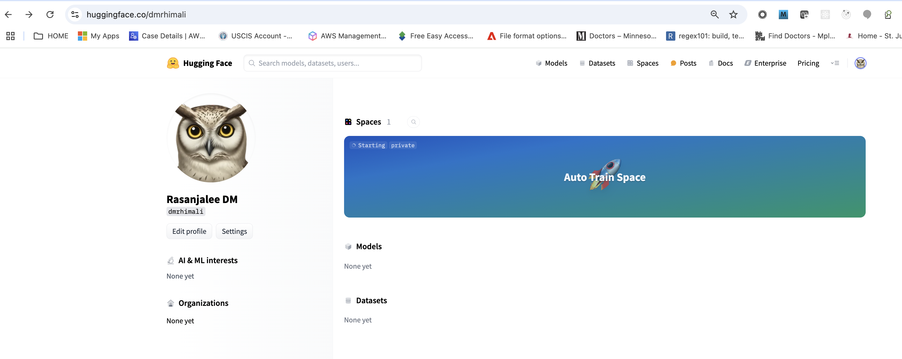
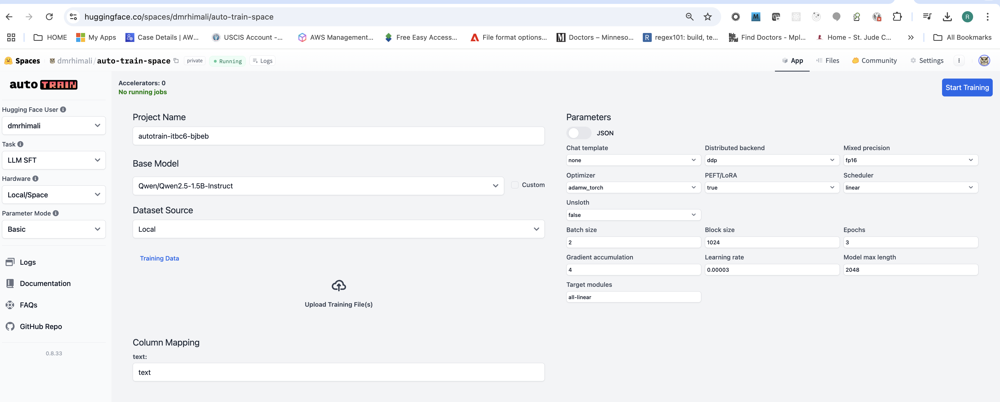
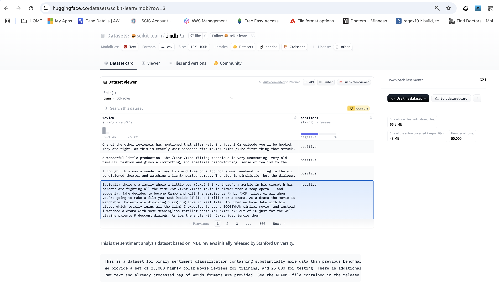
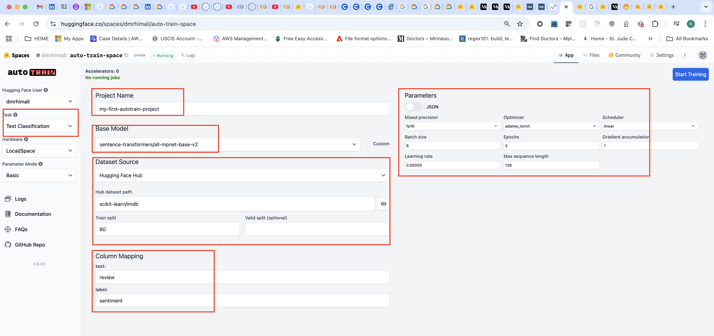

# Auto train
`AutoTrain`: is an automatic way to train and deploy state-of-the-art Machine Learning models, seamlessly integrated with the Hugging Face ecosystem. AutoTrain" generally refers to the broader concept of a no-code platform for training machine learning models across various tasks,

` AutoTrain Advanced`: (tool) The user-friendly interface within Hugging Face Spaces that allows users to easily train models through a visual interface with minimal configuration required. Faster and easier training and deployments of state-of-the-art machine learning models. AutoTrain Advanced is a no-code solution that allows you to train machine learning models in just a few clicks. Please note that you must upload data in correct format for project to be created. For help regarding proper data format and pricing, check out the documentation.


- [Auto train locally](#auto-train-locally)
- [Auto train in Hugging Face Spaces](#auto-train-in-hugging-face-spaces)

## Auto train locally

Note: <span  style="color:red">You'll need an M1 or M2 mac to do this as you need gpus locally. However, bitsandbytes is not natively supported on Apple M1 chips (or other Mac GPUs without CUDA capability), meaning the bitsandbytes library is designed primarily for NVIDIA GPUs and cannot properly utilize your Mac's hardware; therefore, the environment validation might fail in training step.  </span>

- [Quickstart Guide for Local Training](https://huggingface.co/docs/autotrain/en/quickstart)
- Follow [How to Finetune phi-3 on MacBook Pro](https://huggingface.co/blog/abhishek/phi3-finetune-macbook)


## Auto Train in Hugging Face Spaces
The no code fine tune solution. `This will cost you money if this is not your first project.`


NOTE: <span  style="color:red">AutoTrain is free! You only pay for the resources you use in case you decide to run AutoTrain on Hugging Face Spaces. When running locally, you only pay for the resources you use on your own infrastructure.</span>

Ref: 
- [Install AutoTrain Locally to Fine-Tune Any Model](https://www.youtube.com/watch?v=vajTcKkN58c)
- [How to Fine Tune or train your model in hugging face with or without coding](https://www.youtube.com/watch?v=OCNraV2Toa0&list=PL8Ctjqcyssq-zViibB66HdLlQfAqq__Uk&index=12)
- 

Ref: [Fine-tuning Falcon-7b-instruct using PEFT- LoRA on Free GPU](https://medium.com/@srishtinagu19/fine-tuning-falcon-7b-instruct-using-peft-lora-on-free-gpu-6fa1b0fcbcb)

## Create huggingface api tokens [is not not needed anymore]
To fine tune models we need hugginface tokens. You will be `reading models as well as writing back fine tuned models` so you need `both read access and write acccess` tokens.

1. Go to https://huggingface.co/ > Your Avatar on upper right corner > Access Tokens
2. Clcik `Create New Token` 
3. Give Name: `apikey-read-write` 
4. Select read and write permission
5. Clcick `Create Token`
6. Save the key somewhere safe, this is the last time you will see it.
   




## Create space
Hugging Face Spaces make it easy for you to create and deploy ML-powered demos in minutes. They are like appliations in your account. You can create applications, create models in your space etc.

- Huggingface Spaces Overview: [Spaces Overview](https://huggingface.co/docs/hub/en/spaces-overview)
- Huggingface spaces: [huggingface spaces](https://huggingface.co/spaces)
- Checkut an example space: [click on a tetris space example](https://huggingface.co/spaces/openfree/Tetris-Game)


### create space for auto train
1. Go to your hugginface account: https://huggingface.co/dmrhimali > your avatar in upper right corner > New Space
2. Give name: `auto-train-space`
3. Select the Space SDK: `Docker`
4. Choose a Docker template: `AutoTrain`
5. Choose Space hardware: CPU Basic 2vCpu, 16GB FREE
6. Choose `Private`:  Only you (personal Space) or members of your organization (organization Space) can see and commit to this Space.
7. Click `Create Space`



Now if you go to your account `https://huggingface.co/dmrhimali` you can see your new auto train space:



When you click above space and login with Hugging Face you will land in this page:

https://huggingface.co/spaces/dmrhimali/auto-train-space


### Enter auto train details:
1. Give `project name`: `my-first-autotrain-project`
2. select `task` : `text-classification`
3. select `base model`: `sentence-transformers/all-mpnet-base-v2    `

Se  here for more text classification: [HuggingFace Text Classification](https://huggingface.co/docs/autotrain/v0.6.10/en/text_classification)

### upload train data

see here for some sample data: [10 Datasets for Fine-Tuning Large Language Models](https://odsc.medium.com/10-datasets-for-fine-tuning-large-language-models-d27f5a9b2a9a)

We will go with [huggingface imdb reviews dataset](https://huggingface.co/datasets/scikit-learn/imdb)




I  your auo-train space Enter:
1. `Data source`: huggingface hub (instead you can select locl and upload a csv as well)
2. `hub-datase-path`: scikit-learn/imdb
3. `train-split`: 80
   

#### set column mapping

https://huggingface.co/docs/autotrain/en/col_map

`text` key: your data (e.x.: sentence)
`label` key: label/ categories you want to predict on (e.x. sentiment of the sentence)

E.x.: `{"text": "sentence", "label":"sentiment"}`


**what if you have multiple data columns annd multiple label columns? :**
specify as a dictionary: 
- text: sentence and name of person who said it
- label: sentiment and how toxic the sentence is.

E.x.: `{"text": "sentence, personName", "label":"sentiment, toxicity"}`

[huggingface imdb reviews dataset](https://huggingface.co/datasets/scikit-learn/imdb) has two columns review(i.e. label) and sentiment(i.e. label):

Enter them :
1. Column mapping `text`: review
2. Column mapping `label`: sentiment
   
Your screen should finally look like this:



### train
Currently, with a free account you get one free AutoTrain project ; when creating subsequent projects, AutoTrain will present you with an estimated project training cost, before you start the job. They then issue and send invoices on a project basis to the account email address on file - typically within a week of the project training ending


Click `Start Training` and you will see trained model in around 2 days.

You might get message:
```sh
AutoTrain is a paid offering and you will be charged for this action. You can ignore this message if you are running AutoTrain on a local hardware. Are you sure you want to continue?

Yes, I'm sure
No, cancel
```
### delete space
https://huggingface.co/pricing


hf hub is forver free. if you like you can delete or pause space from runnig:
- Enter your huggingface space
- click `settings`
- find `delete space` option
- delete space
  
## Auto train in colab (did not work due to torch version issue)

We will follow [huggingface autotrain colab notebook](https://github.com/huggingface/autotrain-advanced/blob/main/colabs/AutoTrain_LLM.ipynb)

Change the domain in above link from`github.com` to `githubtocolab.com`. The notebook will open in `Colab`. Then you can save a copy in your drive.

Go to `https://huggingface.co/datasets/timdettmers/openassistant-guanaco/viewer` > clcick `SQL` button > `SELECT * FROM train LIMIT 100;` > Run Query  > Download ([query_result.parquet](notebooks/05_Falcon7B_FineTune/05_02_Autotrain/data/query_result.parquet))> upload it to `https://konbert.com/convert/parquet/to/csv` > Download csv (This solves issue of manually doing it and dealing with commas in text)


Rename csv file to `train.csv`> in colab notebook create folder nmed `data` and  upload train.csv.

Run cells, one at  time. Last cell errors out: `AttributeError: module 'torch.library' has no attribute 'register_fake'`

```js
function ClickConnect(){
console.log("working")
document.querySelector("colab-toolbar-button").click()
}setInterval(ClickConnect, 60000)
```