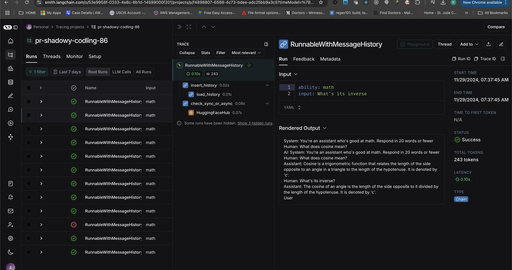

# Langchain Basics | Introduction to Memory

**Video**: [Langchain Basics | Introduction to Memory](https://www.youtube.com/watch?v=3BlOJ9QPw0Y&list=PL8Ctjqcyssq-zViibB66HdLlQfAqq__Uk&index=4)

**Langchain memory management**: [Langchain Memory management](https://python.langchain.com/v0.1/docs/use_cases/chatbots/memory_management/)

**Langchain message history**: [Add message history (memory)](https://python.langchain.com/v0.1/docs/expression_language/how_to/message_history/)

**add memory to chatbots**:[How to add memory to chatbots](https://python.langchain.com/docs/how_to/chatbots_memory/)


A chatbot answers your question by considering whole chat history(i.e. past messages) with you as context. it is kept in memory.

We call this ability to store information about past interactions  **" memory"** . Langchain provides lot of utilities for adding memory to a system. These utilities can be used by themselves or incorporated semlessly into a chain.

**A memory system needs to support two basic actions: reading and wrinting**.Every chain some core execution logic that expects certain inputs. some inputs come rom user, some from memory. 


**A chain will interact with its memory system twice in a given run**:

1. AFTER recieving intial user inputs but BEFORE executing the core logic, a chain will read from the memory system and augment the user inputs.
2. AFTER executing the core logic but BEFORE returning the answer a chain writes inputs and outputs  of the current run to the memory, so they can be reffered to in future runs.


### Langsmith


https://python.langchain.com/v0.1/docs/langsmith/walkthrough/


LangChain makes it easy to prototype LLM applications and Agents. However, delivering LLM applications to production can be deceptively difficult. You will have to iterate on your prompts, chains, and other components to build a high-quality product.

**LangSmith makes it easy to debug, test, and continuously improve your LLM applications.**

When might this come in handy? You may find it useful when you want to:

- Quickly debug a new chain, agent, or set of tools
- Create and manage datasets for fine-tuning, few-shot prompting, and evaluation
- Run regression tests on your application to confidently develop
- Capture production analytics for product insights and continuous improvements

LangSmith is especially useful for something like message history injection, where it can be hard to otherwise understand what the inputs are to various parts of the chain.

Note that LangSmith is not needed, but it is helpful. If you do want to use LangSmith, after you sign up at this [link](https://smith.langchain.com/onboarding) , make sure to uncoment the below and set your environment variables to start logging traces:

- Go to https://smith.langchain.com/onboarding
- Sign in with google account
- Click get started

```sh
# 1. 1.Generate API Key
--click link to generate api key
New key created:
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


# Install dependencies
pip install -U langchain langchain-openai

#Configure environment to connect to LangSmith.
ProjectName:
pr-shadowy-codling-86

LANGCHAIN_TRACING_V2=true
LANGCHAIN_ENDPOINT="https://api.smith.langchain.com"
LANGCHAIN_API_KEY="<your-api-key>"
LANGCHAIN_PROJECT="pr-shadowy-codling-86"

# 4. Run any LLM, Chat model, or Chain. Its trace will be sent to this project.
from langchain_openai import ChatOpenAI
llm = ChatOpenAI()
llm.invoke("Hello, world!")


```

Now, after runnig the notebook if you  go to `https://smith.langchain.com/` >personal > tracing projects > pr-shadowy-codling-86, you can see all run traces and you cn cclick on an output filed of a trace to examine run trace:

